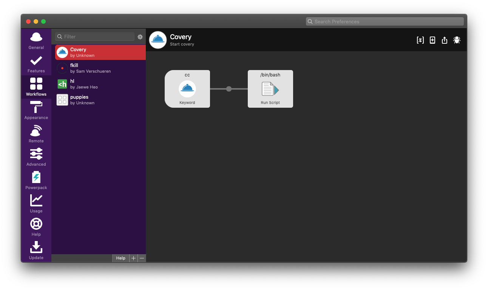
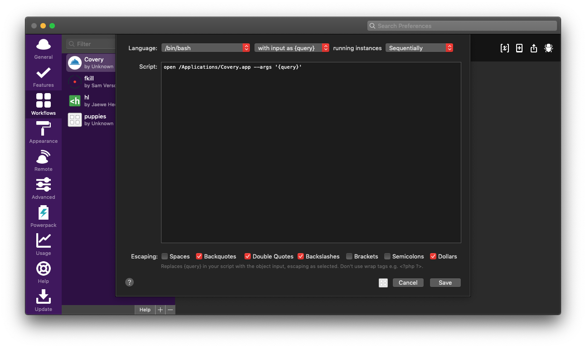
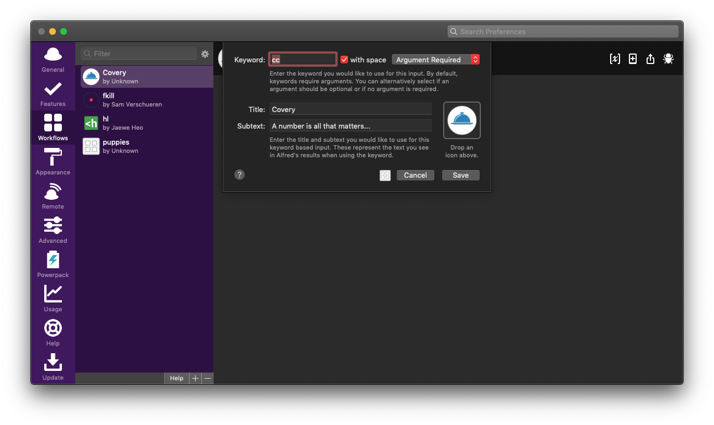

# Covery

> A number is all that matters...


Covery is an electron app that let's you display (and format) a phone number for demo purposes. The window will stay on top of other windows which makes it a little bit nicer to come over "the daunting number moment".

## How can I use it?

Head over to the [release section](https://github.com/stefanjudis/covery/releases) and download/install the latest release. This will give you the `Covery.app` file. When you double-click it though it will tell you that you have to use it via the command line. The command to start is as follows:

```
open /Applications/Covery.app --args 'THE PHONE NUMBER'
```

For Alfred users you can set up a custom workflow for it and run the app with the following:

```
open /Applications/Covery.app --args '{query}'
```





### Navigate via keyboard

Covery will start centered with a fairly big window size. To move it to the upper right/left corner you can use `CMD+left` or `CMD+right`. To center it again go with `CMD+enter`. :) To close it again focus the app and go with the usual `CMD+q`.
